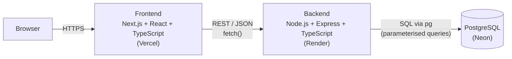

# Lead Tracker

A small full-stack app to create sales leads, search them, and move them through a status pipeline.

**Live app:** https://lead-tracker-sage-ten.vercel.app
**Live API:** https://lead-tracker-backend-6a6o.onrender.com ([health check](https://lead-tracker-backend-6a6o.onrender.com/health))

> The API runs on Render's free tier, which sleeps when idle. The first request after a quiet period can take up to a minute while it wakes up.

## Features

- **Create lead**: name, email and phone. The API sets the status to `NEW` and records `created_at`.
- **List leads**: newest first.
- **Search leads**: partial and case-insensitive match on name or email, combined with a status filter.
- **Update lead status**: `NEW → CONTACTED → QUALIFIED → CONVERTED / LOST`, straight from the table.
- **Validation**:
  - Duplicate emails, including ones that differ only in case, are rejected.
  - The API returns clear messages that the UI shows inline, and the form keeps its input when a request fails.

## Architecture



| Layer | Tech | Notes |
|---|---|---|
| Frontend | Next.js 16 (App Router), React 19, TypeScript, Tailwind CSS 4 | One client-rendered page that calls the API from the browser. |
| Backend | Node.js, Express 4, TypeScript, `pg` | REST API with raw, parameterised SQL and no ORM. |
| Database | PostgreSQL (Neon, serverless) | A single `leads` table defined in [`backend/src/schema.sql`](backend/src/schema.sql). |
| Tests | Vitest, Supertest, pg-mem, React Testing Library | They run in CI on every push. |

### Project structure

```
lead-tracker/
├── backend/
│   ├── src/
│   │   ├── app.ts          # createApp(pool): routes, validation, CORS
│   │   ├── server.ts       # entry point: reads env, creates the pg Pool, starts listening
│   │   └── schema.sql      # leads table
│   └── tests/
│       └── leads.test.ts   # API tests against an in-memory Postgres
├── frontend/
│   ├── app/                # layout.tsx, page.tsx (the Lead Tracker screen)
│   ├── components/         # CreateLeadForm, LeadTable
│   ├── lib/                # api.ts (typed API client), useDebouncedValue.ts
│   └── __tests__/          # API client, component and page tests
├── .github/workflows/ci.yml
├── README.md
└── AGENT.md                # how AI tools were used
```

`createApp(pool)` is separate from `server.ts` so tests can pass in an in-memory database instead of connecting to a real one.

### Data model

| Column | Type | Rules |
|---|---|---|
| `id` | `SERIAL` | Primary key |
| `name` | `VARCHAR(255)` | Required, trimmed |
| `email` | `VARCHAR(255)` | Required, valid format, stored lowercase, `UNIQUE` |
| `phone` | `VARCHAR(20)` | Optional |
| `status` | `VARCHAR(50)` | `NEW` by default. `CHECK` limits it to `NEW`, `CONTACTED`, `QUALIFIED`, `CONVERTED` or `LOST`. |
| `created_at` | `TIMESTAMP` | Set by the database |

### API

Base URL: `http://localhost:5000` locally, or the live API URL above.

| Method | Path | Body / query | Success | Errors |
|---|---|---|---|---|
| `GET` | `/health` | | `200 {"status":"ok"}` | |
| `POST` | `/api/leads` | `{ name, email, phone? }` | `201` created lead | `400` invalid input, `409` email exists |
| `GET` | `/api/leads` | `?search=&status=` (both optional) | `200` array of leads, newest first | `400` unknown status |
| `GET` | `/api/leads/:id` | | `200` lead | `400` invalid id, `404` not found |
| `PATCH` | `/api/leads/:id/status` | `{ status }` | `200` updated lead | `400` invalid id/status, `404` not found |

Errors always come back as `{ "error": "message" }`.

```bash
curl -X POST http://localhost:5000/api/leads \
  -H "Content-Type: application/json" \
  -d '{"name":"John Doe","email":"john@example.com","phone":"9876543210"}'

curl "http://localhost:5000/api/leads?search=john&status=NEW"

curl -X PATCH http://localhost:5000/api/leads/1/status \
  -H "Content-Type: application/json" \
  -d '{"status":"CONTACTED"}'
```

## Setup instructions (local)

**Prerequisites:** Node.js 22+ and PostgreSQL 14+. Docker works too if you don't have Postgres installed.

### 1. Clone

```bash
git clone https://github.com/Harish-Shejokar/lead-tracker.git
cd lead-tracker
```

### 2. Database

Using a local Postgres:

```bash
createdb lead_tracker
psql lead_tracker -f backend/src/schema.sql
```

Or using Docker:

```bash
docker run --name lead-tracker-db -e POSTGRES_PASSWORD=postgres -e POSTGRES_DB=lead_tracker -p 5432:5432 -d postgres:16
docker exec -i lead-tracker-db psql -U postgres -d lead_tracker < backend/src/schema.sql
```

`schema.sql` uses `IF NOT EXISTS`, so running it again is safe.

### 3. Backend

```bash
cd backend
cp .env.example .env   # set DATABASE_URL if yours differs
npm install
npm run dev            # http://localhost:5000
```

| Variable | Required | Description |
|---|---|---|
| `DATABASE_URL` | yes | Postgres connection string. Append `?sslmode=require` when connecting to a hosted database from outside its network. |
| `PORT` | no | Defaults to `5000`. |
| `CORS_ORIGIN` | no | Comma-separated list of allowed frontend origins. Any origin is allowed when unset. |

### 4. Frontend

In a second terminal:

```bash
cd frontend
cp .env.example .env   # NEXT_PUBLIC_API_URL=http://localhost:5000
npm install
npm run dev            # http://localhost:3000
```

### 5. Tests

```bash
cd backend && npm test    # 43 API tests
cd frontend && npm test   # 31 UI and API-client tests
```

- **Backend:** the tests send real HTTP requests to the Express app with Supertest. The database is [pg-mem](https://github.com/oguimbal/pg-mem), an in-memory Postgres built from the real `schema.sql`, so the actual SQL runs without a database server. They cover every endpoint, including the validation, 404, 409, CORS and database-failure paths.
- **Frontend:** the tests use Vitest and React Testing Library with the API client mocked. They cover loading, the empty and error states, debounced search, the status filter, creating a lead (success and failure) and updating a status.
- **CI:** [`.github/workflows/ci.yml`](.github/workflows/ci.yml) runs both test suites and both production builds on every push to `main` and on pull requests.

## Deployment steps

The live setup is Neon (PostgreSQL), Render (API) and Vercel (frontend).

### 1. Database: Neon PostgreSQL

1. Create a project at [neon.tech](https://neon.tech) and copy its connection string. It already includes `?sslmode=require`.
2. Create the table, either by pasting `backend/src/schema.sql` into Neon's SQL Editor or from your machine:
   ```bash
   psql "<neon-connection-string>" -f backend/src/schema.sql
   ```

### 2. Backend: Render Web Service

1. Go to **New → Web Service** and connect this GitHub repo.
2. Configure the service:
   - **Root Directory:** `backend`
   - **Build Command:** `npm install --include=dev && npm run build`
   - **Start Command:** `npm start`
3. Set the environment variables:
   - `DATABASE_URL`: the Neon connection string.
   - `CORS_ORIGIN`: the frontend URL, e.g. `https://lead-tracker-sage-ten.vercel.app`.
4. Deploy, then check `https://<service>.onrender.com/health`.

### 3. Frontend: Vercel

1. Go to **Add New → Project** and import this GitHub repo.
2. Set **Root Directory** to `frontend`. The framework preset (Next.js) is detected automatically.
3. Set the environment variable `NEXT_PUBLIC_API_URL` to the Render service URL, e.g. `https://lead-tracker-backend-6a6o.onrender.com`.
4. Deploy.

`NEXT_PUBLIC_*` variables are baked in at build time, so redeploy the frontend after changing it.

With auto-deploy on (the default for both Render and Vercel), every push to `main` redeploys both services, and CI runs the tests.

## Trade-offs

| Decision | Why | Cost |
|---|---|---|
| **Raw SQL with `pg` instead of an ORM** | Four queries don't need an ORM. The SQL stays explicit and every query is parameterised, which prevents SQL injection. | No generated types or migrations. Row types are declared by hand. |
| **A single `schema.sql` instead of a migration tool** | The simplest thing that works for one table. | Schema changes to an existing database, like the status `CHECK` constraint, have to be applied by hand with `ALTER TABLE`. |
| **`ILIKE '%term%'` search** | Simple, case-insensitive, partial matching with no extra infrastructure. | A leading wildcard can't use a B-tree index, so every search scans the whole table. That's fine for thousands of leads, not millions. |
| **No pagination** | The expected data size is small, and it keeps the API and UI simple. | Response size and render time grow with the number of leads. |
| **Status as `VARCHAR` + `CHECK` instead of a Postgres `ENUM`** | Easy to add or rename statuses later. It's validated in the API and in the database. | The status list lives in three places: the schema, the API and the UI. |
| **Refetch the list after each create or update** | The list always matches the server and respects the active search and filter. | One extra request per change. The UI isn't optimistic. |
| **Next.js as a client-rendered single page** | Standard React + TypeScript tooling with zero-config deployment on Vercel. | The page doesn't use server rendering, so data loads after the page does. |
| **pg-mem for API tests** | Fast tests with no setup that still run the real SQL and schema constraints. | It's an emulator, so rare Postgres-specific behaviour could differ from production. |
| **Open CORS by default** | Local development works without extra configuration. | `CORS_ORIGIN` must be set in production to restrict it. |
| **No authentication** | Out of scope for the assignment. | Anyone with the URL can create and update leads. |
| **Free-tier hosting** | Zero cost. | The API has cold starts after being idle. |

## Future improvements

- **Pagination and sorting** on the list endpoint and the table.
- **Authentication**, so each user or team only sees their own leads.
- **Edit and delete leads**, with notes and a status-change history showing who changed what and when.
- **Migrations** with a tool like `node-pg-migrate`, instead of a single schema file.
- **Faster search** with a `pg_trgm` GIN index or Postgres full-text search.
- **Shared validation** with a schema library such as `zod`, used by both frontend and backend. This would also remove the duplicated status list.
- **End-to-end tests** with Playwright against the deployed stack, plus CI tests against a real Postgres service container.
- **Hardening:** rate limiting, security headers (`helmet`) and structured request logging.
- **Optimistic status updates**, so the UI responds instantly.
- **Phone validation and formatting**, e.g. with `libphonenumber`.
